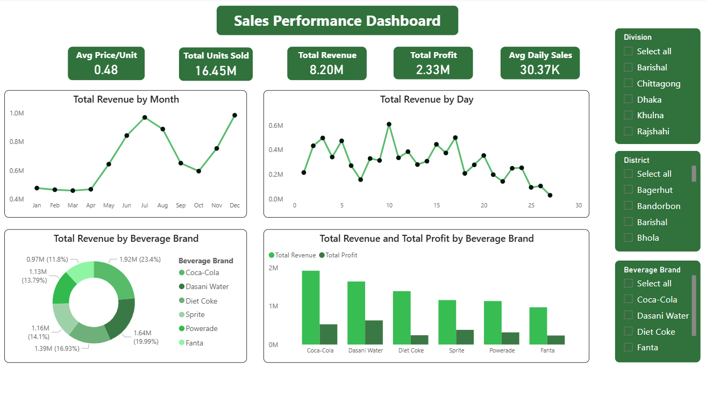

# Sales Performance Dashboard  

📊 A Power BI dashboard analyzing beverage sales performance across different divisions and districts.  

## 📌 Overview  
This dashboard provides insights into sales and profit trends for multiple beverage brands. It includes key KPIs, revenue analysis, and filters for detailed exploration.  

## 🗂️ Dataset  
- **Source**: Sample beverage sales dataset (assignment dataset)  
- **Columns**: Division, District, Beverage Brand, Units Sold, Revenue, Profit, etc.  

## 🔑 Key Features  
- **KPIs at a glance**:  
  - Avg Price/Unit: 0.48  
  - Total Units Sold: 16.45M  
  - Total Revenue: 8.20M  
  - Total Profit: 2.33M  
  - Avg Daily Sales: 30.37K  

- **Visuals Included**:  
  - Total Revenue by Month  
  - Total Revenue by Day  
  - Revenue by Beverage Brand (Pie Chart)  
  - Revenue vs Profit by Beverage Brand (Bar Chart)  

- **Filters**: Division, District, Beverage Brand  

## 🛠️ Tools Used  
- **Power BI Desktop** – Data visualization & dashboarding   

## 📸 Screenshot  
  

## 🚀 How to Use  
1. Download the `.pbix` file from this repository.  
2. Open it in **Power BI Desktop**.  
3. Explore the dashboard and interact with the filters.  
